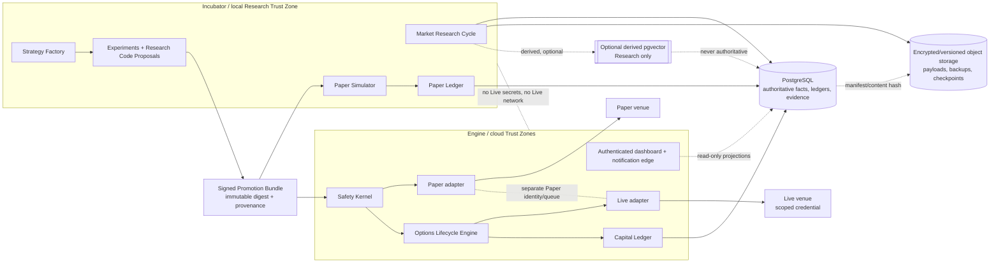

# Engine and Incubator containerization and local-to-cloud portability feasibility

Research date: 2026-08-22  
Issue: [#57 — Engine and Incubator containerization and local-to-cloud portability feasibility](https://github.com/jaylamping/market-mate/issues/57)  
Status: decision-ready research; planning-only; no accounts, credentials, orders, or deployment authority granted

## Decision summary

Market Mate can reduce early operating cost with a local-first, containerized Incubator, but the safe portability unit is **several bounded OCI images under a Compose application**, not one image that contains every responsibility. The same immutable, signed image digest may be promoted from local Research/Paper to cloud Paper and eventually Restricted Live; the environment must supply different identities, secrets, networks, data permissions, ledgers, and authority. Image reuse is not trust-zone reuse.

The recommended shape is:

1. Docker Compose on the Principal's Mac for Research and qualified local Paper. Docker Desktop is the reference runtime because it directly supports the required Compose contract and multi-platform builds. Colima is a lower-footprint fallback. Podman is a possible later alternative, but its VM/rootless and Compose compatibility differences add qualification work.
2. A small number of separately deployable services, each with a single responsibility and a least-privilege identity. Research, Paper, and Live remain separate Trust Zones even if they share a physical host.
3. PostgreSQL remains the sole authoritative transactional/evidence store. Encrypted, versioned object storage holds canonical large payloads, exports, replay fixtures, and backups. No authoritative ledger, evidence, signing material, or durable object payload lives only in a container layer or disposable container volume.
4. A permanent SQL/full-text/no-vector path is required. A semantic index, if later justified, is a disposable, derived Research projection (preferably pgvector inside the existing PostgreSQL boundary); it never becomes canonical and is never required for Paper or Live safety.
5. Local Research and qualified Paper are allowed. Restricted Live is **cloud-only** and remains disabled until the approved cloud Environment passes identity, uptime, monitoring, recovery, authentication, incident, broker-entitlement, and independent-review gates. A cloud container being reachable is not a Live certification.
6. DigitalOcean is the simplest Cloud Paper candidate; AWS is the stronger Restricted Live candidate because IAM/workload identity, KMS, S3 versioning/Object Lock, ECS/Fargate, and RDS provide more mature control primitives. Neither provider is selected by this report; the provider and host-isolation bakeoff belongs in the architecture decision ticket.

This resolves the feasibility question conditionally: **local-first containerization is feasible and recommended for Research/Paper; promotion to Live is feasible only as a separately certified cloud deployment with a fresh environment epoch and Principal approval.**

## Scope, boundaries, and settled project contracts

This report applies the project vocabulary in [`CONTEXT.md`](../../CONTEXT.md) and the closed governance decisions already attached to the blueprint. In particular:

- An **Execution Environment** is Paper or Live. Records are never commingled.
- A **Trust Zone** is a workload boundary with its own identity, secrets, network policy, queues, data permissions, and audit controls. Physical co-location never grants authority.
- A **Research Sandbox** can read approved, unprivileged evidence and append constrained experiments/proposals. It cannot reach broker credentials, deploy, merge, write canonical evidence, write Policy, or write Paper/Live state.
- A **Research Code Proposal** is executable code authored by an agent but has no runtime or deploy authority. Dependency, build, deployment, and broader write changes require a Principal Authorization Decision.
- A **Promotion Bundle** is a signed, immutable collection of strategy/model/policy/data/adapter/capability/test/evidence versions. Live binds environment details but does not rebuild the economic logic.
- The **Paper Ledger** and **Capital Ledger** are append-only, balanced, and separate. Every bounded continuity interval is an **Environment Epoch**; a destructive reset or out-of-band control action starts a new epoch rather than rewriting history.
- Agents may propose executable changes but cannot deploy write authority without Principal approval. No local credential copy, environment variable, image layer, or build log may become a substitute for a governed Authority Grant.

These are requirements, not implementation suggestions. Compose profiles, project names, host separation, and provider choice must preserve them.

## Provisional domain boundaries

“Incubator” and “Engine” are provisional names for trust and authority boundaries, not permission to collapse the system into one container.

| Responsibility | Incubator: local Research/Paper boundary | Engine: cloud Paper/Live boundary | Authority and data rule |
|---|---|---|---|
| Strategy Factory | Generates strategy hypotheses, parameter sets, tests, and Research Code Proposals. | Consumes only approved Promotion Bundles; no self-modifying strategy code. | Agent output is schema-validated and resource-bounded declarative data. Executable changes require Principal-reviewed PR and signed provenance. |
| Market Research Cycle | Retrieves approved source data, normalizes it, records Research Snapshots and rights/as-of metadata, and runs experiments. | Runs approved scheduled research in a cloud Research/Paper zone when needed for availability; never reads Live secrets. | External content is untrusted data, never instructions. Data entitlements are recorded and cannot be silently broadened. |
| Paper execution | Simulates fills using the conservative Paper overlay; writes only the local Paper Ledger for its epoch. | Cloud Paper may run continuously for certification; uses a Paper adapter/account and separate Paper roles, queues, and evidence. | Paper never points at a Live credential, Capital Ledger, or Live queue. |
| Safety Kernel | Evaluates Paper Risk Decisions and qualification tests; local version is non-live. | Deterministic admission, containment, kill/freeze, and recovery checks in the cloud Engine. | Only the certified Engine/Safety Kernel may submit a Live order, and only with a scoped, revocable Authority Grant. |
| Options Lifecycle Engine | Simulates expiry, exercise, assignment, corporate actions, and reconciliation. | Owns production lifecycle state and broker reconciliation for the qualified Live venue. | Lifecycle events are authoritative only after broker reconciliation; no model inference silently changes the Capital Ledger. |
| Paper Ledger | Append-only simulated balanced ledger, separate by Environment Epoch. | Cloud Paper ledger remains separate from Live and may be replayed from evidence. | Paper values do not become capital, and Paper and Live identifiers cannot share a ledger key. |
| Capital Ledger | Not mounted or reachable by local Research/Paper. | Append-only broker-reconciled Live book, accessible only to the Live Engine and read-only audit projections. | No local copy is an authority. Reconciliation and control-handoff epoch rules apply. |
| Venue/data adapters | Unprivileged or Paper adapters only; fixtures can stand in for unavailable services. | Paper and Live adapters are distinct deployments and credentials, with capability manifests. | Adapter capability must be certified per venue, instrument, account, and environment. |
| Dashboard | Local read-only view over local Research/Paper projections. | Public HTTPS dashboard is authenticated and read-only for Live; no public order endpoint. | Frontend Application Administration is distinct from Infrastructure Administration. |
| Notifications | Local development sink and test channels only. | In-app/WebPush → Slack → SMS critical delivery, with redundant attempts; channels are notification-only. | Notification failure never grants execution authority. |
| PostgreSQL | Local instance can be authoritative for a local epoch, but its backup/export is the migration input, not cloud authority. | Managed or hardened external PostgreSQL is authoritative for each cloud environment. | Use separate roles/schemas/databases and explicit `Environment Epoch` keys. |
| Object storage | Local staging may cache payloads, but canonical export is encrypted and content-hashed. | Encrypted, versioned object store holds payloads, backups, signed checkpoints, and replay fixtures. | PostgreSQL manifests include content hash, rights, and object version. |
| Semantic index | Optional derived Research projection; disposable and rebuildable. | No vector dependency in Paper or Live; pgvector only after the measured gate. | SQL/full-text/no-vector path must remain complete and correct. |

### Responsibility diagram



The diagram shows logical ownership, not a guarantee that services must run on separate machines. A shared host is acceptable only when network, identity, filesystem, database role, queue, egress, and audit controls demonstrate the Trust Zone boundary.

## Recommended topology

### Safe unit: bounded images under a Compose application

Use separately built images for `research-cycle`, `strategy-factory`, `paper-simulator`, `safety-kernel`, `options-lifecycle`, `adapter-paper`, `adapter-live`, `dashboard`, and `notifier` as their responsibilities mature. Do not create one “market-mate” image containing every process, credential, scheduler, and database client.

One container would make process failure, resource accounting, patching, secret scope, network egress, and deployment rollback inseparable. It would also encourage a shared superuser/database credential and make it difficult to demonstrate that Research cannot reach Live. A single image can be acceptable for a narrow stateless utility or a short-lived fixture worker, but not for the complete system.

The image boundary is not the data boundary. All environments use the same schema and interfaces only where the contract is intentionally portable; each environment gets separate database credentials, object-store prefixes/buckets, queue namespaces, broker accounts, signing verification policy, and Environment Epoch.

### Environment shapes

| Environment | Runtime shape | Services enabled | Persistent state | Forbidden capability |
|---|---|---|---|---|
| Local Research | Docker Compose `research` profile on the Principal's Mac | Research Cycle, Strategy Factory, fixture adapter, dashboard read model, optional derived index | Local PostgreSQL and encrypted export staging; object payloads must be exportable | Broker write, Live adapter, Capital Ledger, deploy, merge, raw broker credentials |
| Local Paper | Same Compose project with a separate project name and `paper` profile, ideally a separate DB volume/role | Research inputs, Paper Simulator, Paper Ledger, Paper adapter if certified, Safety Kernel in Paper mode, dashboard | PostgreSQL Paper epoch plus encrypted object export; never shares Research or Live ledger tables | Live credentials, Live queues, withdrawals, Capital Ledger, automatic promotion |
| Cloud Paper | Hardened Linux VM/Compose first; managed orchestration only after scale/SLO need | Paper Engine, qualified adapter, Research jobs, dashboard edge, notifier, external PostgreSQL/object store | Managed PostgreSQL, versioned object storage, encrypted backups/WAL, signed checkpoints | Live broker endpoint/credential, public order route, automatic Live promotion |
| Restricted Live | Approved cloud Linux host or managed container service, separate Live Trust Zone | Safety Kernel, Options Lifecycle Engine, Live adapter, reconciliation, minimal dashboard projections, notifier | External PostgreSQL, object store, WAL/PITR, immutable audit checkpoints | Research network/identity, public ingress to execution, agent deployment, automatic resumption |
| Autonomous Live (future) | Same certified Engine contract with increased Authority Grant scope only after the staged rollout gate | Mature deterministic Engine and approved strategy/policy versions | Same authoritative stores and evidence controls | Unbounded strategy changes, unsupervised authority expansion, destructive reset in-place |

Compose supports multiple files, profiles, health checks, explicit networks, resource limits, read-only filesystems, capability drops, non-root users, and service-scoped secrets. Use those controls as an executable contract, not as optional local convenience. See the [Compose service reference](https://docs.docker.com/reference/compose-file/services/), [Compose networks](https://docs.docker.com/reference/compose-file/networks/), [Compose secrets](https://docs.docker.com/reference/compose-file/secrets/), [Compose profiles](https://docs.docker.com/reference/compose-file/profiles/), and [Compose startup-order guidance](https://docs.docker.com/compose/how-tos/startup-order/).

### Compose project contract

Keep the deployment files versioned and reviewable:

```text
compose.yaml                         # common image digests, health, limits, networks
compose.incubator.yaml               # Mac-only Research/Paper profiles, fixtures
compose.cloud-paper.yaml             # cloud Paper identities and external services
compose.cloud-live.yaml              # Live-only identities, egress, and gates
compose.test.yaml                    # failure injection and isolated ephemeral services
env.example                          # names and types only; no values or secrets
```

Required properties:

- `research`, `paper`, and `live` are distinct Compose project names, not merely profile values. A command or credential from one project must not address the other project's network or socket.
- Each service runs as a non-root UID, with `read_only: true` except a narrowly declared temporary filesystem. Drop all Linux capabilities by default and add none without a documented test and approval.
- Set CPU, memory, PID, file-descriptor, and log-size ceilings. Reserve resources for Safety Kernel, reconciliation, audit, and notifications; pause low-priority Research first.
- Use explicit `internal: true` networks for database, ledger, and control-plane traffic. Permit egress by service allowlist; dashboard and notification relay never share the Live adapter network.
- Use Compose secrets or a cloud secrets manager for runtime values. Never use `use_api_socket`, mount `/var/run/docker.sock`, mount the host filesystem broadly, or expose Docker Desktop's API socket to any application service.
- Bind-mount source code only in the local development profile. Cloud images run from immutable digests with no source checkout and no package installation at startup.
- Use health checks and dependency conditions for readiness, but do not treat `depends_on` as a distributed transaction or a proof of recovery. Every write path is idempotent and checkpointed.
- Disable the Live service in all local files through an absent profile and admission check. The cloud Live file must reject a Research or Paper identity and require a signed Promotion Bundle plus Principal approval record.

## Local runtime alternatives

| Option | Benefits for a single Principal | Costs, limitations, and licensing | Decision |
|---|---|---|---|
| Docker Desktop | Direct Compose UX, Docker Buildx, multi-platform image support, predictable documentation, easiest parity with Linux Docker hosts and CI. | Runs a Linux VM on macOS and consumes memory; commercial license terms apply to larger organizations. Docker Desktop is free for personal use and small businesses below its published employee/revenue thresholds; verify the current [license terms](https://docs.docker.com/subscription/desktop-license/) if ownership changes. | **Reference local runtime.** Best fit for the current single-Principal scope. |
| Colima + Docker CLI | MIT-licensed, light VM, Apple Silicon/Intel support, Docker/containerd/Kubernetes/Incus runtime choices, works with existing Compose commands. Default resources are modest and user-adjustable. | Another VM/context to maintain; Docker Desktop integrations, credential helpers, file sharing, Buildx/QEMU behavior, and support ergonomics require explicit tests. | **Approved fallback.** Re-run the full portability and security suite before using as a certification machine. See [Colima](https://github.com/abiosoft/colima). |
| Podman machine | Rootless-by-default posture, open source, macOS VM, daemonless design. | macOS still needs a Linux VM; Compose/provider, networking, volume, registry, secret, and Buildx parity is not identical. A rootless local result is not evidence that the cloud runtime has the same behavior. | **Defer as a compatibility target.** Use only after a documented Podman profile and test matrix. See [Podman machine](https://docs.podman.io/en/stable/markdown/podman-machine.1.html). |
| Local Kubernetes/k3d/Minikube | Stronger orchestration primitives and possible future manifest portability. | High cognitive/maintenance cost for one Principal; storage, ingress, observability, upgrades, and security become a second platform. It does not solve authority or data-boundary requirements automatically. | **Do not start here.** Keep Compose manifests portable and revisit after real scale/SLO evidence. |
| Cloud Run locally/remote | Low-ops stateless services and event-driven jobs; useful for bounded Research workers. | Cloud Run supports Linux `x86_64`, ephemeral writable filesystem, request/time limits, and stateless HTTP assumptions. It cannot be the sole stateful Engine; using worker pools plus external stores creates provider coupling. See [Cloud Run container contract](https://docs.cloud.google.com/run/docs/container-contract). | **Optional future Research worker.** Not the initial Engine runtime. |

Docker Desktop's multi-platform build path supports `linux/amd64` and `linux/arm64` image indexes; emulation is convenient but slower than native builders. See [multi-platform builds](https://docs.docker.com/build/building/multi-platform/) and the [Mac installation requirements](https://docs.docker.com/desktop/setup/install/mac-install/). The local acceptance target is a native Mac arm64 run and an amd64 cloud run from the same digest.

## Local Research and Paper limits

Local-first does not mean local-authoritative for every purpose. It means the Principal can safely explore and produce evidence without paying for an always-on cloud Engine.

### Local Research is permitted to

- ingest free or already-authorized delayed/public sources within the [data entitlement and budget](https://github.com/jaylamping/market-mate/issues/41);
- run deterministic normalization, point-in-time snapshots, indicators, source correction/deletion workflows, experiments, strategy proposals, and no-vector retrieval;
- build and test images, schemas, adapters, Paper fixtures, and failure-injection harnesses;
- produce signed Promotion Bundle candidates and evidence for Principal review;
- use synthetic or replayed market data where live data rights or availability are not present.

It is not permitted to access raw broker credentials, Live endpoints, withdrawal or transfer functions, a Capital Ledger, production signing keys, or an unreviewed external content tool. A Research Code Proposal may be executable in a sandbox, but it is not deployable authority.

### Local Paper is permitted to

- run the exact deterministic Safety Kernel and Options Lifecycle Engine in Paper mode;
- exercise the Paper adapter against a separately authenticated paper account only after adapter capability certification;
- maintain a separate Paper Ledger and Environment Epoch;
- measure conservative fill, latency, quote-quality, and reconciliation behavior;
- generate the evidence required by issue 8 (at least 60 trading sessions and 30 independent matured opportunities, whichever is longer, plus required event cycles).

It is not permitted to imply Live economics from delayed/indicative/free data, to use a Live broker token, to merge a Paper Ledger into the Capital Ledger, or to auto-promote a bundle. The current project data policy requires a paid/consolidated entitlement for serious Paper Certification where free data cannot support the claim; the provisional Alpaca $99/month plan is an example to certify, not a permanent commitment.

### Mac operational ceiling

The reference Mac profile should start at 2–4 vCPU, 4–8 GiB RAM assigned to the Linux VM, and a 40–100 GiB encrypted workspace, then be benchmarked against the Principal's actual machine. Docker Desktop documents a 4 GiB minimum; this is not a project performance guarantee. Keep the local Paper dataset bounded by the approved universe and retention policy, and export/archive before disk utilization reaches 70%.

Mac sleep, restart, laptop-network loss, clock drift, disk exhaustion, Docker daemon failure, and context switching are expected events. A local interruption must leave the environment in a paused/recoverable state; it must never be interpreted as a clean Live handoff.

## Cloud Live gate

No Restricted Live capability may be enabled by choosing a cloud provider or by running `docker compose up`. The cloud gate requires all of the following:

1. Principal identity provider and recovery path are selected under the managed-identity bakeoff. MFA/passkey recovery and account lockout have been tested.
2. Infrastructure Administration is separately authenticated from Application Administration. The execution service has one workload identity and only a trade-scoped, withdrawal-disabled broker credential; Research, dashboard, model, and notification services cannot read it.
3. The cloud host, network, secrets manager, image registry, database, object store, backups, audit path, monitoring, and incident channel pass the security review from issue 32. Live has no public order ingress.
4. A signed Promotion Bundle is verified by digest, provenance, SBOM, vulnerability policy, and expected builder/source identity. The production admission controller rejects mutable tags, unverified provenance, high/critical vulnerabilities outside an approved exception, and a bundle not bound to the target Environment Epoch.
5. Paper/Live venue capability, broker authentication, market-data entitlement, options permissions, event semantics, order atomicity, exercise/assignment, reconciliation, rate limits, and outage behavior pass the executable broker certification path in the broker research.
6. Backup/WAL/PITR restore is tested to a new environment, including signed checkpoint verification, ledger sequence, content hashes, object versions, and broker reconciliation. Recovery enters read-only/Recovery State and never auto-resumes Live.
7. Notification and external host-down monitoring are exercised. Critical alerts attempt redundant delivery through the accepted channels, and the Principal can freeze via a broker-native/direct runbook even when the application is unavailable.
8. A Principal signs a fresh Live Activation after a clean certification run. The signature is recorded in the audit stream and cannot be generated by an agent or the deployment pipeline.

The existing security decision permits a shared physical cloud host initially only when the Trust Zone controls above are real and independently reviewed. Reassess physical separation before another user/public API, above $10,000 of capital, or an independent review finds host isolation insufficient.

## Security and threat model

The main threat is not only a compromised container. It is an authority confusion in which a convenient local or cloud component gains a credential, network route, ledger write, signing capability, or recovery action it was never granted.

| Threat / failure | Preventive boundary | Detection/evidence | Required response |
|---|---|---|---|
| Research image or external content attempts prompt/tool escape | No privileged tools, non-root/read-only filesystem, no Docker socket, no host mounts, strict egress, schema validation | Runtime audit, denied egress, image scan, sandbox test fixtures | Kill Research workload; preserve evidence; quarantine bundle and review proposal. |
| Paper service reaches Live broker or Capital Ledger | Separate Compose projects/networks, identities, DB roles, object prefixes, queues, and broker endpoints; no Live secret in local profiles | Negative connectivity tests and secret inventory | Fail acceptance; rotate any exposed credential; start a new epoch if needed. |
| Dashboard becomes an order path | Read-only API projections, no Live adapter network route, authenticated Principal actions only through control plane | API contract tests and request audit | Remove route, revoke session, review audit stream. |
| Supply-chain compromise or dependency drift | Lockfiles, pinned base/dependency digests, isolated builders, SBOM, SLSA/in-toto provenance, Cosign signature, scanning, admission policy | Verify digest/provenance/SBOM at pull and deploy; weekly rescan | Reject/rollback; revoke signer if compromised; rebuild from known source. |
| Container runs as root or gains kernel capability | `user`, `read_only`, `cap_drop: [ALL]`, `no-new-privileges`, rootless runtime where supported, CPU/PID/memory limits | Policy scan and runtime inspection | Reject artifact/config; do not waive in Live without Principal decision. |
| Secret copied from local Mac into image/log/env | Build secret mounts, runtime cloud secret manager, `.gitignore` and secret scanner, redaction | Image/history/log/prompts scan; canary secret tests | Revoke and rotate; freeze promotion; preserve forensic artifacts. |
| Docker daemon or host compromise | Rootless/least privilege, host patching, no socket mounts, separate Live host and infrastructure identity | Host monitoring, image/process inventory, independent uptime check | Freeze broker at venue, preserve suspected host, replace from signed definitions; no automatic resume. |
| Database tampering/deletion | Separate DB roles, append-only ledger/evidence rules, encrypted backups, WAL/PITR, signed checkpoints, immutable object copies | Sequence/hash/checkpoint verification, restore drill | Recovery State, read-only, reconcile broker, Principal handback. |
| Object retention or entitlement conflict | Versioned encrypted object store, PostgreSQL manifest and rights/deletion override, access logging | Hash/version/rights audit | Mark evidence unavailable/invalid; do not silently use stale/deleted payload. |
| Vector index leaks or becomes canonical | Derived pgvector only, per-row environment/rights/as-of/content hash, complete SQL fallback | Rebuild/destroy and leakage tests; compare exact IDs | Drop/rebuild vector; canonical evidence and ledger remain unchanged. |
| Time drift or stale approval | Trusted synchronized time, monotonic expiry, timestamped epoch/Decision Record | Clock-drift test and audit check | Invalidate pending approvals/time-sensitive actions; require fresh Principal approval. |
| Partial migration or rollback | Export manifest, per-object checksum, DB dump/WAL position, restore to new epoch, replay/reconciliation | Migration journal and negative isolation test | Keep old environment read-only; abandon target epoch; retry only from verified export. |
| Notification/provider outage hides risk | Independent external check plus redundant notification routes; notification-only channels | Heartbeat, alert delivery test, audit of attempts | Freeze or stay read-only according to Safety Kernel; use direct broker runbook. |

Docker's [Engine security guidance](https://docs.docker.com/engine/security/) and [rootless mode](https://docs.docker.com/engine/security/rootless/) support reducing capabilities and avoiding unnecessary root authority. AWS's [ECS task/container security guidance](https://docs.aws.amazon.com/AmazonECS/latest/developerguide/security-tasks-containers.html) provides a useful cloud review checklist even if ECS is not selected.

### Threat-cost matrix

The cheapest architecture is not the one with the fewest containers; it is the one that avoids unpriced authority, recovery, and migration failures. The matrix makes the trade explicit. “Incremental cost” is a planning band, not an approval to spend.

| Control decision | Threat reduced | Local Research/Paper cost effect | Cloud Paper cost effect | Restricted Live implication |
|---|---|---|---|---|
| Separate bounded services and Trust Zone networks | A Research/model/dashboard process reaches Live or corrupts a ledger | More Mac RAM/process overhead; usually within existing hardware | More service/monitoring configuration; minimal direct spend on a VM | Mandatory. Physical separation can become mandatory at issue 32 triggers. |
| External managed PostgreSQL plus WAL/PITR | Container loss, disk loss, tampering, unrecoverable ledger/evidence | Local DB can run in Compose; encrypted export/restore time is the cost | ~$15–30/mo single-node candidate; HA roughly doubles the DB component | Use encrypted managed/hardened DB, separate roles, restore drill; HA/RPO choice can push total above the Paper target. |
| Encrypted/versioned object storage and signed checkpoints | Payload deletion, backup corruption, evidence/hash mismatch | Local encrypted staging plus periodic external export | ~$5/mo Spaces or small S3/object budget before transfer/retention | Use provider KMS/Object Lock or equivalent only after rights/deletion review; retain a provider-independent export. |
| Multi-arch pinned build + SBOM/provenance/signature/scan | Supply-chain substitution and Mac/cloud architecture drift | CI/build time and registry storage; no required cloud runtime spend | Registry/CI/scanner and log costs are usually small but must be metered | Mandatory admission gate; signer custody, revocation, and vulnerability exceptions require Principal decision. |
| Managed identity/secrets and separate broker credential | Credential copy, withdrawal, prompt/log/image leakage | Local OS keychain/test secrets only; no Live token | Provider secret/IAM features and operational setup; AWS primitives cost less than a breach but add configuration | Mandatory. Live credential never enters local Compose or Research image; reauth freezes Live until recertified. |
| External uptime/alert redundancy | Host/provider/notification outage hides a risk state | Local test sink; existing external monitor can probe cloud | Usually ≤$15/mo within alert/monitor cap, plus SMS/provider fees | Mandatory. Alerts are notification-only; direct broker freeze/recovery path must work when app is down. |
| Full failure/migration drills and independent review | Partial deploy, bad restore, epoch collision, silent data loss | Engineering time and temporary disk/fixtures; no new provider required | Restore/test instances and retained backups add variable compute/storage | Mandatory before Live. A cheaper single-node design may be rejected if it cannot meet measured RPO/RTO. |
| Optional semantic index | Research retrieval latency/miss rate | Rebuildable local disk/CPU; no authoritative backup | Prefer existing PG/pgvector; avoid a dedicated vector service and its extra cost | Never a Live dependency. Drop/rebuild must not alter canonical evidence or ledgers. |

### Network segmentation

The minimum network graph is:

```text
dashboard/notifications  -> authenticated control/read API only
research                  -> approved data egress + research DB role + object prefix
paper                     -> paper adapter + paper queue + paper DB role
safety/options            -> paper or live adapter according to environment binding
live adapter              -> broker endpoints + reconciliation + live DB role only
database/object store    -> no inbound public access
```

The Live adapter must not share a network with Research/model services. The dashboard may read a projection but cannot issue an order or mount a ledger. A notification worker may publish a signed alert but cannot accept a command from Slack/SMS.

## Build, release, signing, and scanning contract

The artifact pipeline is part of the safety boundary. The contract below must be represented as CI checks and deployment admission checks before Cloud Paper, and must be mandatory before Restricted Live.

### Build inputs

- Build from a reviewed commit, lockfiles, and a declared source repository/ref. Record builder identity, commit, build parameters, target platform, base image digest, dependency graph, and UTC start/end times.
- Pin base images by digest and dependencies by lockfile/hash. Do not install floating packages at container startup.
- Use BuildKit secret/SSH mounts for private package access; never pass credentials via `ARG` or `ENV` because they can persist in image history/layers. See [Docker build secrets](https://docs.docker.com/build/building/secrets/).
- Set a fixed `SOURCE_DATE_EPOCH` and normalize archive/file ordering where the toolchain permits. Docker documents this as a reproducibility aid in its [cache invalidation guidance](https://docs.docker.com/build/cache/invalidation/). The acceptance test compares manifest/config/filesystem digests across two clean builds with the same inputs; if a language/toolchain is not bit-for-bit reproducible, record the non-deterministic field and require provenance plus digest verification instead of claiming reproducibility.
- Produce `linux/arm64` and `linux/amd64` images from the same source and publish an OCI index. Build natively on both architectures when practical; use QEMU for compatibility checks, not as the only release proof.

### Attestations and policy

- Emit an SPDX or CycloneDX SBOM; SPDX is a recognized SBOM specification ([SPDX overview](https://spdx.dev/use/overview/)).
- Emit SLSA v1.2-compatible provenance and in-toto link/attestation metadata. Provenance must identify the trusted builder, source, build type, and external parameters; the verifier checks those fields rather than merely checking that a signature exists. See [SLSA provenance](https://slsa.dev/spec/v1.2/provenance), [SLSA verification](https://slsa.dev/spec/v1.2/verifying-artifacts), and [in-toto](https://in-toto.io/).
- Sign the immutable image digest and attestations with Sigstore Cosign. Keyless signing binds an ephemeral signing key to an OIDC identity and records transparency evidence in Fulcio/Rekor; production can use a KMS-backed key if the custody decision requires it. See [Cosign signing](https://docs.sigstore.dev/cosign/signing/overview/) and [Cosign verification](https://docs.sigstore.dev/cosign/verifying/verify/).
- Run a vulnerability scanner at build and deploy. Docker Scout can inventory an SBOM and evaluate CVE/VEX policy ([Scout](https://docs.docker.com/scout/), [Scout policy](https://docs.docker.com/scout/policy/)); an equivalent scanner is acceptable if its database, cadence, and report are retained.
- Block critical vulnerabilities immediately; block high vulnerabilities affecting auth, secrets, Live, Safety Kernel, options, or the database within seven days; other high vulnerabilities within 30 days, matching issue 32. Weekly rescans are required for retained Live images.
- The production verifier pins expected repository, builder identity, source ref, build type, target platform, image digest, SBOM/provenance presence, signer identity, vulnerability policy, and Promotion Bundle hash. A mutable tag is a convenience alias and never an authority input.

### Promotion and rollback

1. CI builds and tests both architectures, generates SBOM/provenance, scans, signs, and publishes the digest.
2. A review records test/evidence versions and the Promotion Bundle manifest; a Principal Authorization Decision is required for Safety Kernel, options, adapter, authority, dependency, or deployment changes.
3. The target environment verifies the signed digest and attestation before pull. It validates config schema and ensures no secret appears in bundle/source/image/log metadata.
4. Deploy first to an isolated Cloud Paper epoch, run smoke/reconciliation/failure tests, then obtain the Live Activation if the bundle is eligible.
5. Rollback selects a previously verified digest and restores only code/config. It never rewrites a ledger or silently reuses a prior epoch. If schema migration is not backward-compatible, deploy a new environment and replay rather than rolling the database backward.

## Persistence, backup, and migration

### Data ownership

| Data | Authoritative location | Backup/retention | Container rule |
|---|---|---|---|
| Relational facts, Research Snapshots, indicators, experiments, Decision Records, strategy/model versions, authority, ledger links | PostgreSQL | Encrypted base backup + WAL/PITR; logical export for portability; signed checkpoints | Database is external to application containers in cloud; local container volume is only an implementation convenience and must be exportable. |
| Paper Ledger | PostgreSQL append-only tables keyed by Paper environment/epoch | Base backup/WAL + periodic ledger/checkpoint export | Paper role cannot insert Capital Ledger rows. |
| Capital Ledger | PostgreSQL append-only tables keyed by Live environment/epoch, broker IDs | Base backup/WAL + immutable signed checkpoints and broker statements | Live role only; Research/Paper has no network or DB privilege. |
| Raw/normalized payloads, replay fixtures, large exports, backup artifacts | Encrypted/versioned object storage, with PostgreSQL manifest | Versioning; Object Lock/retention where lawful and appropriate; 35-day daily, 13-month monthly, 7-year annual financial/audit retention | Never store only in container filesystem. Content hash and object version are required. |
| Semantic embeddings/index | Derived pgvector or other disposable Research projection | Rebuild from canonical rows; no backup needed for correctness | No vector index is required for Paper/Live. |
| Runtime secrets, broker credentials, signing keys | Managed secrets/KMS/HSM or local OS keychain for development | Rotation/revocation evidence; never ordinary DB/object backup | Never in image, git, Compose YAML, logs, prompts, or Research export. |

PostgreSQL's [backup guidance](https://www.postgresql.org/docs/current/backup.html) distinguishes logical dumps, filesystem backups, and continuous archiving. Its [continuous archiving/PITR guidance](https://www.postgresql.org/docs/current/continuous-archiving.html) explains that base backup plus WAL permits point-in-time recovery and that an unmonitored archive can fill and stop the database. Use both a portable logical export and a tested base-backup/WAL path. Use distinct [roles and privileges](https://www.postgresql.org/docs/current/ddl-priv.html); only narrowly privileged owners/superusers should alter schema, and application roles should not be superusers.

For object storage, S3 [versioning](https://docs.aws.amazon.com/AmazonS3/latest/userguide/Versioning.html) retains object versions, [Object Lock](https://docs.aws.amazon.com/AmazonS3/latest/userguide/object-lock.html) provides WORM retention/legal hold when appropriate, and default/KMS encryption is documented in the [S3 server-side encryption API](https://docs.aws.amazon.com/AmazonS3/latest/API/API_ServerSideEncryptionByDefault.html). Object retention must still honor approved deletion/rights decisions; WORM is not a license to retain content unlawfully.

### Migration runbook

Migration means creating a new Environment Epoch, not copying an active authority into another container and continuing in place.

1. **Freeze and identify.** Principal requests a migration window. Stop new Research/Paper/Live writes according to the Safety Kernel; cancel or fence pending submissions; record source environment, source epoch, code digest, schema version, and last audit/checkpoint sequence.
2. **Quiesce.** Drain idempotent jobs and notification queues. Capture PostgreSQL LSN/WAL position, ledger balances, pending Decision Records, broker open-order/position snapshot, object manifest, vector model/index metadata, and clock/host metadata. Make the source read-only.
3. **Export.** Produce a custom-format `pg_dump`/schema export plus base-backup/WAL where available. Export all referenced object versions, manifests, replay fixtures, signed checkpoints, and broker statements. Do not export secrets or signing private keys.
4. **Checksum and sign.** Generate a deterministic manifest containing file/object hashes, sizes, source epoch, LSN, schema, bundle digest, rights metadata, and export time. Sign the manifest/checkpoint with the migration signer; store a copy outside the source host.
5. **Restore to a new target epoch.** Create new DB, object prefix/bucket, queue namespace, network identity, and service identities. Restore the database and objects. Restore indexes only as derived data; keep canonical rows and no-vector path usable before any index rebuild.
6. **Verify.** Check signatures, row counts, ledger sequence/hash chains, balances, foreign keys, object hashes/versions, rights/deletion state, schema migration, timezone/clock assumptions, and all environment/epoch identifiers. Run application read-only smoke tests.
7. **Replay and reconcile.** Replay the migration journal and idempotent events from the captured checkpoint. Reconcile Paper with its venue or Capital with the broker; compare open orders, positions, cash, option lifecycle state, and fees. Differences block promotion.
8. **Negative isolation.** Prove the target cannot reach the source network, source secrets, source queue, or wrong broker endpoint. Prove a target Paper service cannot write source Capital Ledger tables and that a target vector rebuild cannot alter canonical rows.
9. **Principal approval.** Principal reviews the manifest, test evidence, reconciliation, cost, provider, and epoch transition. Record a new Authority Grant/Live Activation only for the target. Keep the source read-only until retention and rollback expiry.
10. **Rollback.** If any verification or reconciliation fails, stop target writes, preserve both environments, revoke target credentials, and return to the source only through the existing recovery/handback procedure. Do not “fix” a mismatch by editing ledger history. Abandon the target epoch and retry from the signed export.

### Recovery targets

Use the existing issue 32 targets as minimums: no intentionally lost acknowledged Capital Ledger/order/approval/Risk Decision/Venue Event/security-audit event; checkpoint within one minute; other state RPO five minutes; read-only recovery within four hours, Paper within twelve hours, Live eligibility within 24 hours. These are acceptance targets to measure, not guarantees of a provider's marketing SLA.

## Failure-test matrix

Each failure test must record the image digest, environment/epoch, injected fault, event sequence, final state, alerts, recovery operator, and whether any authority or ledger invariant was violated. Run the applicable suite before Local Paper, Cloud Paper, and every Restricted Live deployment; repeat the non-destructive subset on every release.

| Fault injection | Expected safe result | Evidence/gate |
|---|---|---|
| Mac sleep during Research/Paper write | Idempotent checkpoint; process resumes or remains paused; no duplicate ledger event; user-visible stale state | Local Research and Local Paper gates |
| Mac restart/Docker daemon restart | Containers restart only according to profile; secrets are reloaded from approved store; no Live service starts; Paper reconciles before accepting new work | Local Paper gate |
| Network loss / DNS failure / broker timeout | Adapter stops new submissions, records timeout, retries only with idempotency, reconciles before retry; Safety Kernel can freeze | Paper and Cloud Paper gates; Live preflight |
| Clock drift forward/backward | Time-sensitive approval/quote/order expires or freezes; monotonic timers protect deadlines; alert records drift | All environments |
| Disk exhaustion / WAL archive full | Low-priority Research stops first; DB refuses unsafe writes or enters protected read-only mode; alert fires before data loss; recovery preserves checkpoint | Local Paper and cloud recovery |
| Docker image pull/daemon failure | Existing verified release remains running or Engine enters safe freeze; no mutable-tag pull; rollback is digest-based | Cloud Paper/Live deployment gate |
| Image rollback | Prior digest passes signature/provenance and schema compatibility; ledger and evidence remain; no replay duplication | Build/release gate |
| Partial deploy / one service old, one new | Compatibility check blocks unsafe mixed versions; queues/idempotency handle safe overlap; otherwise entire environment freezes | Cloud Paper/Live gate |
| PostgreSQL restore to point in time | New epoch restores; WAL replay/checkpoint hashes and ledger sequence verify; source remains read-only | Migration and DR gate |
| Object-store version missing or delete marker | Manifest detects mismatch; evidence becomes unavailable/invalid; no silent fallback to wrong version | Evidence/migration gate |
| Provider outage / host failure | Independent uptime alert; Engine freezes; direct broker runbook works; replacement built from signed definitions; no automatic Live resume | Restricted Live gate |
| Interrupted migration at each step | Target epoch is incomplete and unusable; source remains read-only/rollback-ready; restart from signed manifest or abandon | Migration gate |
| Secret rotation/revocation | Old credential fails; new credential is loaded without logging; broker reauth and Principal recertification required | Cloud Paper/Live gate |
| Signer or registry compromise simulation | Admission rejects an untrusted signer/tag; revocation/rotation procedure produces an audit record; prior trusted digest remains identifiable | Build/release gate |
| Research-to-Live negative access | Network, DNS, IAM, DB, object, queue, and secret access attempts fail and are logged | Mandatory before any Live approval |
| Vector deletion/rebuild | SQL/full-text/no-vector results remain complete; canonical hashes/ledgers unchanged; rebuild is reproducible enough for query results | Research vector gate |

## Cost and operating-envelope comparison

Prices below are current primary-source list prices captured on 2026-08-22, before taxes, data-provider-specific fees, exchange fees, bandwidth overages, and negotiated discounts. They are planning estimates, not a provider quote. The project envelope remains $50/month Research evidence target, $175/month Paper Certification target, $250/month hard monthly ceiling, and $2,000 first-year hard ceiling. Category soft caps and Principal approvals from issue 41 still apply.

### Local profiles

| Profile | Incremental cloud cash | Local resource assumption | Envelope interpretation |
|---|---:|---|---|
| Local Research | $0 cloud; free/public data and existing Mac | 2–4 vCPU, 4–8 GiB VM RAM, 40–100 GiB encrypted disk; benchmark on actual Mac | Fits the $50 Research target if model/embedding/data utilities stay within the $25 model and approved data caps. Mac electricity/storage are real costs but not yet separately priced. |
| Local Paper | $0 cloud before any paid entitlement; same Mac plus replay/cache storage | Add broker Paper account/data as certified; retain encrypted export and backup | Fits the $175 Paper target only if entitlement and model costs remain within approved caps. Paid consolidated data can dominate the target. |
| Colima fallback | Usually $0 software license | Similar VM resources; principal maintains VM/context | Cost saving is not enough to skip parity/security testing. |

### Candidate cloud scenarios

| Scenario | Published components and calculation | Approx. monthly subtotal | Strength/constraint |
|---|---|---:|---|
| DigitalOcean Cloud Paper, single node | 4 GiB Droplet $24 + managed PostgreSQL single node $15 + Spaces $5 + Droplet weekly backup at 20% ($4.80) = **$48.80**. Add provisional consolidated data $99 and auth/alerts up to $15 = **$162.80** before any overage. | $48.80 base; ~$162.80 with data/alerts | Fits the $175 Paper target narrowly. PostgreSQL single node is not HA; object retention/immutability needs validation. Keep Research ingestion and observability lean. |
| DigitalOcean Cloud Paper, lower-cost experiment | 1 GiB Droplet $6 + PG single node $15 + Spaces $5 + backup $1.20 = **$27.20**, before data. | $27.20 base | Useful for smoke tests, not a 75-underlying Paper certification host without resource benchmarks. |
| DigitalOcean HA exception | 4 GiB Droplet $24 + PG HA primary/standby approximately $60 + Spaces $5 + backup $4.80 = **$93.80** before data/alerts. With $99 data, ~$192.80 before other usage. | ~$93.80 base; ~$192.80 with data | Within $250 aggregate but above $175 Paper target when full data is required; requires explicit cost exception and HA justification. |
| AWS Lightsail/managed PG Paper or small Live | Linux VPS Nano $5, Micro $7, Small 2 GiB $12; encrypted 2 GiB managed DB $30 (the 1 GiB $15 tier is documented as not encrypted); object/backup/monitoring estimate $3–8; auth/alerts ≤$15. With $99 data, roughly **$159–164** using a $12 host. | ~$60–65 base; ~$159–164 with data | Stronger IAM/S3/KMS path, but HA DB doubles DB price (2 GiB HA ~$60) and moves the full-data scenario toward ~$190+, requiring the $250 envelope/approval. Exact S3 and network usage must be quoted. |
| AWS ECS/Fargate + RDS | Compute is metered per vCPU/memory-second; add CloudWatch logs, public IPv4, network, load balancer, RDS, object storage, backups, and data. | Not responsibly fixed from list price alone; likely above the $50 cloud soft cap for always-on Live | Good managed-control-plane candidate after scale or audit need; cost calculator and SLO/HA decision required before selection. |
| Fly.io + managed Postgres | Shared-cpu 1x/1 GiB around $5.92 plus volumes; Managed Postgres Basic shared 2x/1 GiB $38, storage extra; Tigris object storage and monitoring separate. | ~$44+ base before object/data | Attractive small footprint, but database migration tooling/alerting and Tigris lifecycle/exit semantics are not mature enough for initial Restricted Live. |
| Cloud Run + external DB/object | Free compute allowance can cover low request volume; paid CPU/memory after allowance; external PostgreSQL/object and worker pool are still required. | Variable; not comparable to an all-in host | Good stateless Research endpoint/job, but x86_64-only, ephemeral filesystem, request limits, and GCP coupling make it a poor sole Engine. |

Primary pricing pages: [DigitalOcean Droplets](https://docs.digitalocean.com/products/droplets/details/pricing/), [DigitalOcean managed PostgreSQL](https://docs.digitalocean.com/products/databases/postgresql/details/pricing/), [DigitalOcean PostgreSQL features](https://docs.digitalocean.com/products/databases/postgresql/details/features/), [DigitalOcean Spaces](https://docs.digitalocean.com/products/spaces/details/pricing/), [AWS Lightsail bundles](https://docs.aws.amazon.com/lightsail/latest/userguide/amazon-lightsail-bundles.html), [AWS Lightsail pricing](https://aws.amazon.com/lightsail/pricing/), [AWS Fargate pricing](https://aws.amazon.com/fargate/pricing/), [Fly.io pricing](https://fly.io/docs/about/pricing/), [Fly Managed Postgres](https://fly.io/docs/mpg/), and [Cloud Run pricing](https://cloud.google.com/run/pricing).

### First-year envelope implication

A staged rollout can fit the $2,000 first-year ceiling only if the always-on cloud period is limited and data/vendor commitments are approved. One illustrative schedule is two months Local Research at $50 ($100), two months Local Paper at $175 ($350), four months Cloud Paper at ~$165 ($660), and four months Restricted Live at ~$190 with an approved HA/data exception ($760), totaling **$1,870 before one-time utilities and contingency**. A full 12 months of always-on cloud at $160–190/month is $1,920–2,280 before setup and therefore is not automatically within the hard first-year ceiling.

The budget gate must pause optional ingestion/embedding/model work at 90%, pause discretionary research at 100%, and continue safety monitoring, broker reconciliation, backups, and risk-reducing controls. Any annual commitment, plan upgrade, new vendor, or ceiling increase needs Principal approval. Do not call a deployment “cost compliant” until actual invoices and metered usage are reconciled.

## Cloud destination comparison and exit strategy

| Destination | Practical role | Identity/secrets | Persistence/operations | Exit and provider dependency |
|---|---|---|---|---|
| AWS Lightsail + managed PostgreSQL/S3/KMS/IAM | Small Cloud Paper and possible first Restricted Live host; later ECS/RDS when controls/scale justify it | Mature IAM task roles, Secrets Manager/KMS, S3 encryption/versioning/Object Lock; more setup | Predictable VPS pricing; managed DB has HA/PITR options; host hardening remains the Principal's responsibility | Instance snapshots can export to EC2, but managed DB/container snapshots are not a complete portability path. Use `pg_dump`/WAL and S3 object manifests. |
| DigitalOcean Droplet + managed PostgreSQL/Spaces | Best simple Cloud Paper candidate and low-cost learning environment | Managed DB credentials/TLS; Droplet does not provide AWS-style workload identity; use a secrets manager and short-lived deployment credentials | Simple VM/container operations; PG daily/PITR features and monitoring; HA raises cost; validate Spaces version/immutability semantics | Standard OCI images, Compose files, PostgreSQL logical/WAL exports, and S3-compatible object copies. Avoid proprietary snapshot authority. |
| Fly.io + Machines/MPG/Tigris | Experimental Cloud Paper or stateless worker | Fly secrets and provider identity; Tigris keys printed once and provider-specific | Managed PG includes backups/HA/encryption but public docs flag migration/alerting work; volumes are regional | OCI images and logical exports help, but Tigris snapshots/forks and bucket lifecycle are provider-specific; no initial Live. |
| Cloud Run + Cloud SQL/GCS | Stateless Research API/jobs, webhook, or dashboard component | GCP IAM/service identity is strong; request model must be bounded | Autoscaling/jobs, but stateless x86_64 contract, ephemeral filesystem, request timeout, and worker-pool complexity | OCI images and PostgreSQL/object exports help; service config/IAM and job semantics require a GCP adapter. |
| Self-managed Kubernetes | Future multi-node/scale or organization requirement | Powerful but broad control-plane and secret surface | Highest maintenance/observability/upgrade cost; no fit for current single Principal | Most portable declaratively, but manifests/storage/network controllers are not portable operational contracts. Defer. |

The exit contract is intentionally boring:

- OCI image digests and SBOM/provenance remain registry-independent and are mirrored to an independent registry or offline archive.
- Compose files, schemas, migration scripts, policy, test fixtures, and failure-injection harnesses are versioned in the repository.
- PostgreSQL data is exported in portable logical format plus a tested base/WAL path. No provider snapshot is the only backup.
- Object payloads are exported with content hash, object version, rights metadata, and a signed manifest to another S3-compatible or filesystem-backed store.
- Broker adapter capability contracts, venue IDs, and environment config are exported without secrets; credentials are reissued and reauthorized in the target environment.
- A migration to another provider always creates a new Environment Epoch and passes the runbook/negative-isolation/reconciliation gates.

## Acceptance gates and stage retirement

| Gate | Entry evidence | Required tests/controls | Exit authority |
|---|---|---|---|
| Local Research | Clean Mac profile; free/approved data; image/build contract | Research cannot reach Paper/Live; deterministic snapshots/replay; resource/disk ceilings; no-vector fallback; restore local export | Research Code Proposal and signed candidate bundle only |
| Local Paper | Research gate; Paper adapter capability and rights approved | Separate Paper project/DB/queue; conservative fill; ledger balance; lifecycle/reconciliation; sleep/restart/network/clock/disk failures; issue 8 evidence accumulation | Paper Evidence Bundle; no Live authority |
| Cloud Paper | Signed multi-arch artifact; cloud identity/secret/network/DB/object setup | Restore/migration to a new epoch; external monitoring; backup/WAL/PITR; provider outage; partial deploy/rollback; paper venue parity; cost telemetry | Cloud Paper certification record; still no Live authority |
| Restricted Live | Cloud Paper and broker certification; managed identity/recovery; security review | Live adapter only sees scoped trade credential; no public order ingress; full threat/failure/DR suite; independent review; alerts and direct freeze runbook; signed Live Activation | Principal-signed Restricted Live Authority Grant |
| Autonomous Live | Mature Paper evidence, performance/drift/strategy/quarantine gates, capital scaling decision | Repeated clean epochs, no unresolved critical/high findings, control handoff/fresh custody, option lifecycle and broker reconciliation, emergency freeze | Bounded Autonomous Live grant; strategy/policy version remains fixed |
| Local retirement/read-only | Cloud Paper or Live has passed migration and recovery; Principal approves | Local Research/Paper export checksum, new cloud epoch replay/reconciliation, negative isolation; local credentials removed/revoked | Local environment becomes read-only archive or is destroyed after retention; never silently becomes a second Live authority |

Retire local Paper only when Cloud Paper's recovery, observability, cost, and evidence cadence are proven for the required window. Keep local Research as a read-only/rebuildable development/archive path unless the Principal explicitly decides that its cost, security, and maintenance no longer justify it.

## Newly surfaced decisions and follow-up tickets

This report answers issue 57 but deliberately does not make choices that belong to the broader architecture or rollout tickets. The following decisions should be tracked there rather than hidden in implementation:

1. **Cloud provider and host-isolation bakeoff (issue 7 enhancement).** Select DigitalOcean Cloud Paper versus AWS Lightsail/ECS/RDS/S3/KMS/IAM for Restricted Live using measured setup, controls, RPO/RTO, alerting, provider outage, portability, and real invoices. Decide when a shared host must become physically separate.
2. **Signed Promotion Bundle and environment admission contract (issue 7/8 dependency).** Define exact manifest schema, signer/key custody and rotation, SLSA/in-toto verification policy, vulnerability exceptions, schema compatibility, and Principal approval UX. Include the digest/epoch binding in deployment tests.
3. **Cloud PostgreSQL/object-store retention and deletion implementation.** Choose provider services and rights/deletion controls that satisfy PostgreSQL WAL/PITR, versioned encrypted object storage, signed checkpoints, and the seven-year financial/audit retention without breaching data entitlement or privacy requirements.
4. **Measured local resource and first-year cost trial.** Run a 30-day Research/Paper benchmark on the actual Mac and one Cloud Paper candidate. Record CPU/RAM/disk, ingest/data costs, backup/restore duration, alert delivery, and whether the $50/$175/$250/$2,000 caps remain realistic.
5. **Paper venue and data entitlement certification.** Resolve which paid data/venue combination supports the 75-underlying capacity and required option lifecycle evidence without claiming that delayed/indicative/free feeds prove Paper economics.

These are proposed follow-up decisions, not blockers to the feasibility conclusion. Do not enable Restricted Live until they are resolved in the canonical architecture/staged-rollout tickets.

## Assumptions to revalidate

- The Principal remains the only user and owns the Mac, cloud account, broker accounts, signing approvals, and operating-cost decisions.
- Docker Desktop's current license terms continue to permit the intended personal/small-business use; ownership or scale changes trigger revalidation.
- The Mac has sufficient CPU/RAM/disk and supports the chosen Docker/Colima VM; actual benchmarks may require smaller local profiles.
- Docker, BuildKit, base images, package registries, scanners, Sigstore, cloud pricing, and provider product features can change. Pin versions and recheck before each gate.
- Current public provider prices are list estimates, not a quote; data, exchange, regulatory, transfer, IPv4, logging, taxes, and backup overages can change the cap decision.
- A broker/venue exposes the paper/live capability, authentication, options lifecycle, and reconciliation events required by the separate certification contract. Documentation alone is not certification.
- Cloud Run's x86_64-only runtime and provider-specific services are not used as the portable Engine base. The release still builds both `linux/arm64` and `linux/amd64`.
- PostgreSQL and object storage remain available and recoverable across provider migration; logical export/WAL and object manifests are tested rather than assumed.
- The project may later choose physical Live-host separation or a managed orchestrator if capital, user count, SLO, audit, or threat conditions cross the issue 32 triggers.

## Source register

The report uses current primary/official documentation, captured 2026-08-22. Product pricing and feature pages are revalidated at each implementation gate.

### Project contracts

- [Issue #57](https://github.com/jaylamping/market-mate/issues/57)
- [Project glossary and contracts](../../CONTEXT.md)
- [Cloud platform, audit dashboard, and execution architecture — issue #7](https://github.com/jaylamping/market-mate/issues/7)
- [Staged validation and restricted live rollout — issue #8](https://github.com/jaylamping/market-mate/issues/8)
- [Security threat model and disaster recovery — issue #32](https://github.com/jaylamping/market-mate/issues/32)
- [Operating costs/data entitlement — issue #41](https://github.com/jaylamping/market-mate/issues/41)
- [Evidence storage/vector retrieval — issue #56](https://github.com/jaylamping/market-mate/issues/56)

### Containers, runtime, and supply chain

- [Docker Compose](https://docs.docker.com/compose/)
- [Compose production](https://docs.docker.com/compose/how-tos/production/)
- [Compose services](https://docs.docker.com/reference/compose-file/services/)
- [Compose networks](https://docs.docker.com/reference/compose-file/networks/)
- [Compose secrets](https://docs.docker.com/reference/compose-file/secrets/)
- [Compose profiles](https://docs.docker.com/reference/compose-file/profiles/)
- [Compose startup order](https://docs.docker.com/compose/how-tos/startup-order/)
- [Compose Bridge](https://docs.docker.com/compose/bridge/)
- [Docker Desktop license](https://docs.docker.com/subscription/desktop-license/)
- [Docker Desktop Mac install](https://docs.docker.com/desktop/setup/install/mac-install/)
- [Docker multi-platform builds](https://docs.docker.com/build/building/multi-platform/)
- [Docker build secrets](https://docs.docker.com/build/building/secrets/)
- [Docker cache invalidation and reproducible timestamps](https://docs.docker.com/build/cache/invalidation/)
- [Docker Engine security](https://docs.docker.com/engine/security/)
- [Docker rootless mode](https://docs.docker.com/engine/security/rootless/)
- [Docker Scout](https://docs.docker.com/scout/)
- [Docker Scout policy](https://docs.docker.com/scout/policy/)
- [Podman machine](https://docs.podman.io/en/stable/markdown/podman-machine.1.html)
- [Colima](https://github.com/abiosoft/colima)
- [Kubernetes containers](https://kubernetes.io/docs/concepts/containers/)
- [Kubernetes image indexes and digests](https://kubernetes.io/docs/concepts/containers/images/)
- [Sigstore Cosign signing](https://docs.sigstore.dev/cosign/signing/overview/)
- [Sigstore Cosign verification](https://docs.sigstore.dev/cosign/verifying/verify/)
- [SLSA v1.2 provenance](https://slsa.dev/spec/v1.2/provenance)
- [SLSA v1.2 artifact verification](https://slsa.dev/spec/v1.2/verifying-artifacts)
- [in-toto](https://in-toto.io/)
- [SPDX overview](https://spdx.dev/use/overview/)

### Data stores and cloud primitives

- [PostgreSQL backup methods](https://www.postgresql.org/docs/current/backup.html)
- [PostgreSQL continuous archiving/PITR](https://www.postgresql.org/docs/current/continuous-archiving.html)
- [PostgreSQL roles and privileges](https://www.postgresql.org/docs/current/ddl-priv.html)
- [PostgreSQL `pg_dump`](https://www.postgresql.org/docs/current/app-pgdump.html)
- [Amazon S3 versioning](https://docs.aws.amazon.com/AmazonS3/latest/userguide/Versioning.html)
- [Amazon S3 Object Lock](https://docs.aws.amazon.com/AmazonS3/latest/userguide/object-lock.html)
- [Amazon S3 default encryption](https://docs.aws.amazon.com/AmazonS3/latest/API/API_ServerSideEncryptionByDefault.html)
- [Amazon ECS IAM roles](https://docs.aws.amazon.com/AmazonECS/latest/developerguide/ecs-iam-role-overview.html)
- [AWS ECS task/container security](https://docs.aws.amazon.com/AmazonECS/latest/developerguide/security-tasks-containers.html)
- [AWS Lightsail](https://docs.aws.amazon.com/lightsail/latest/userguide/what-is-amazon-lightsail.html)
- [AWS Lightsail bundles](https://docs.aws.amazon.com/lightsail/latest/userguide/amazon-lightsail-bundles.html)
- [AWS Lightsail pricing](https://aws.amazon.com/lightsail/pricing/)
- [AWS Lightsail export limits](https://docs.aws.amazon.com/lightsail/latest/userguide/amazon-lightsail-faq-export-to-ec2.html)
- [AWS Fargate pricing](https://aws.amazon.com/fargate/pricing/)
- [Amazon ECS task definitions](https://docs.aws.amazon.com/AmazonECS/latest/developerguide/task_definitions.html)
- [DigitalOcean Droplet pricing](https://docs.digitalocean.com/products/droplets/details/pricing/)
- [DigitalOcean managed PostgreSQL pricing](https://docs.digitalocean.com/products/databases/postgresql/details/pricing/)
- [DigitalOcean managed PostgreSQL features](https://docs.digitalocean.com/products/databases/postgresql/details/features/)
- [DigitalOcean Spaces pricing](https://docs.digitalocean.com/products/spaces/details/pricing/)
- [Fly.io pricing](https://fly.io/docs/about/pricing/)
- [Fly Managed Postgres](https://fly.io/docs/mpg/)
- [Fly Tigris](https://fly.io/docs/tigris/)
- [Google Cloud Run pricing](https://cloud.google.com/run/pricing)
- [Cloud Run overview](https://docs.cloud.google.com/run/docs/overview/what-is-cloud-run)
- [Cloud Run container contract](https://docs.cloud.google.com/run/docs/container-contract)
- [Cloud Run request timeout](https://docs.cloud.google.com/run/docs/configuring/request-timeout)
- [Cloud Run jobs](https://cloud.google.com/run/docs/create-jobs)

## Resolution

Issue #57 is resolved by this report for the feasibility and planning question. The report recommends a bounded Compose-based Incubator, externally persisted authoritative data, signed multi-architecture artifacts, strict Trust Zone separation, and a cloud-only Live gate. Provider selection, measured cost trial, and final signed-admission/retention contracts are intentionally surfaced as follow-up decisions under the architecture and rollout tickets.
